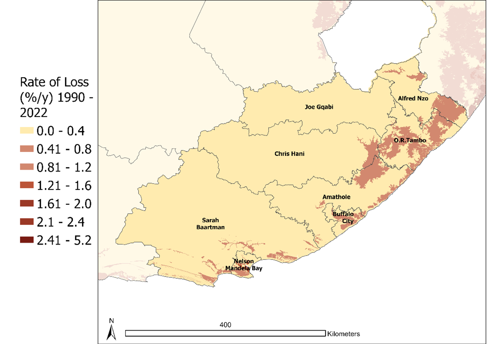
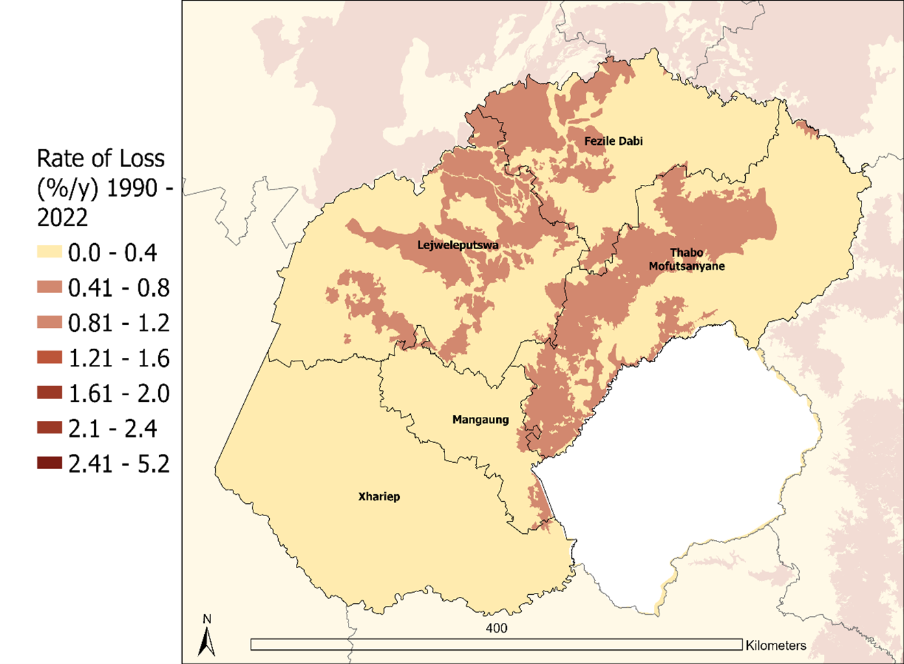
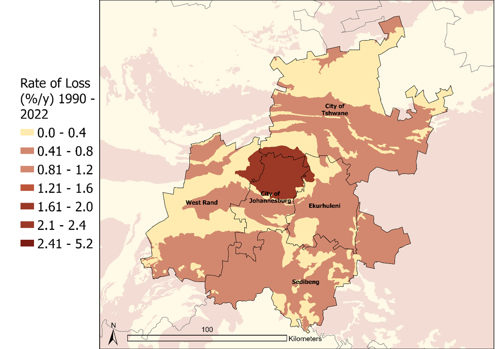
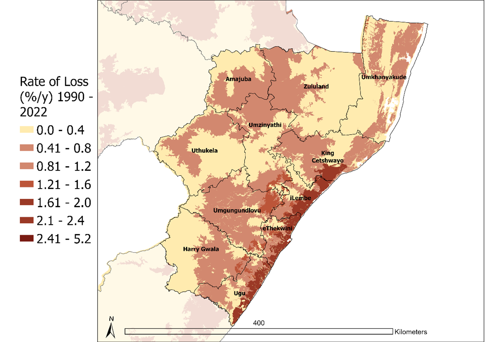
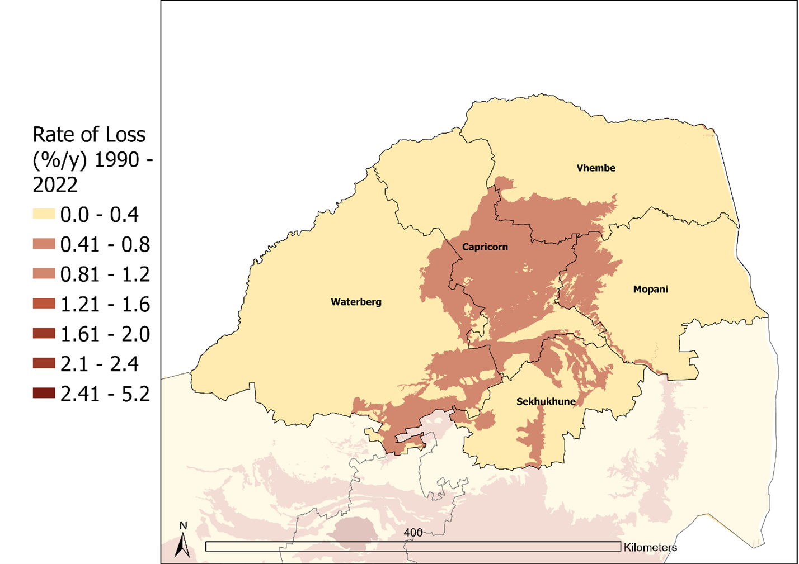
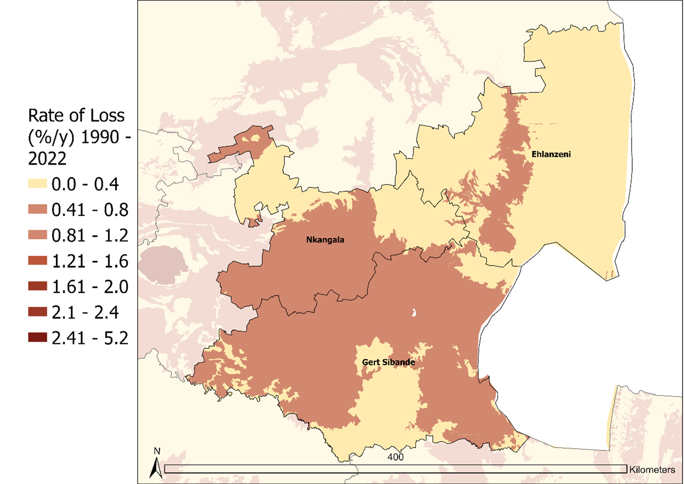
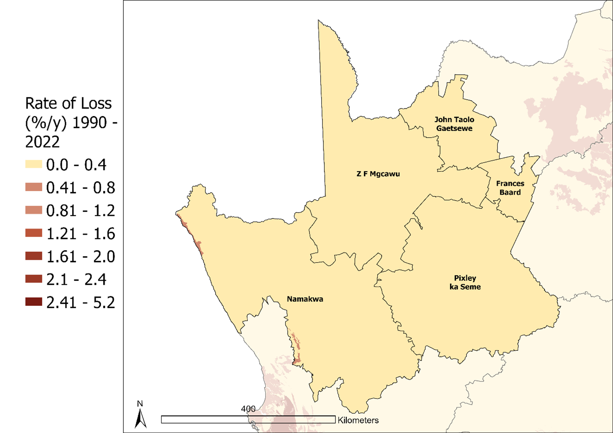
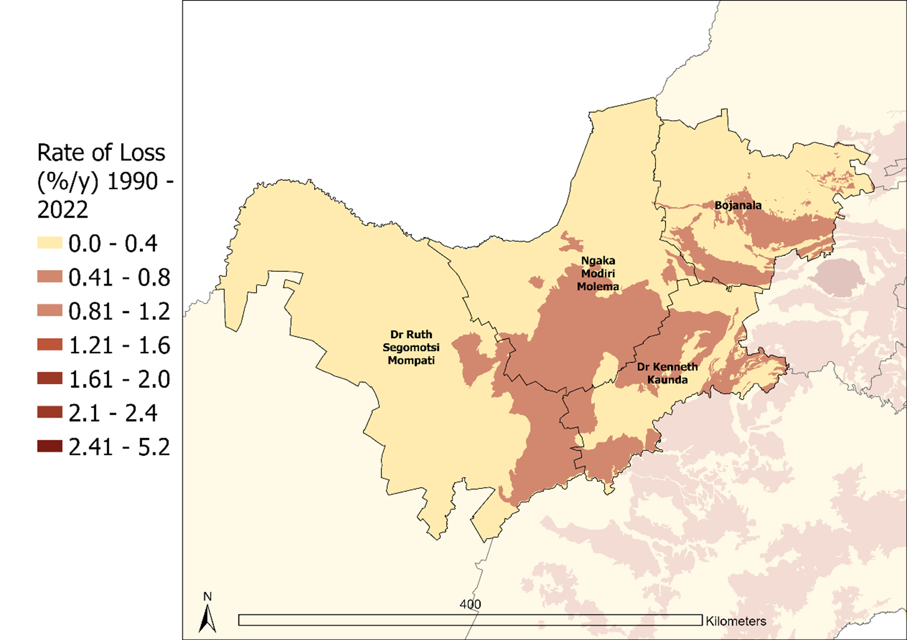
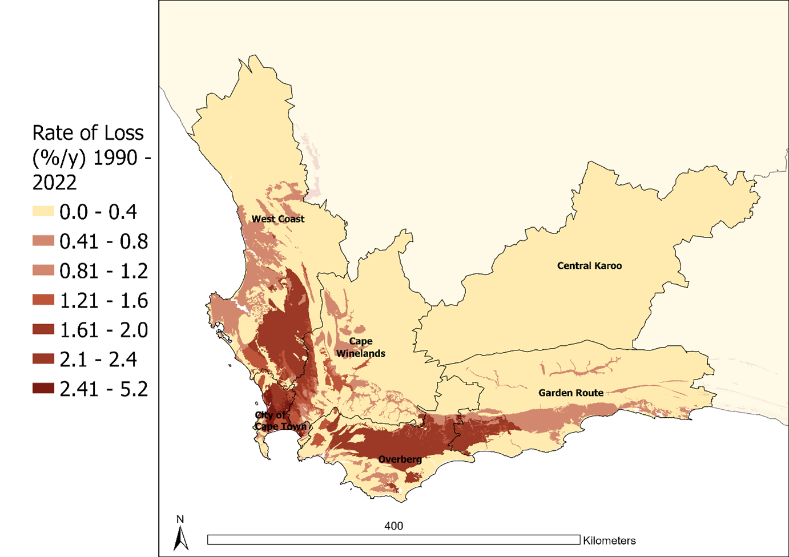

## Summary

South Africa’s biodiversity is subject to a complex interplay of natural and anthropogenic pressures. Land cover data between 1990 and 2022 shows variability of pressures from land use. Among the various pressures on biodiversity, croplands account for the most extensive impact, covering large areas across the country. Built-up areas represent the second most widespread pressure, followed by plantations, which continue to reduce the extent of natural ecosystems. Between 1990 and 2014, cropland and secondary-natural areas expanded noticeably, alongside growth in Built-up areas, plantations, mines, and artificial waterbodies (Figure 1). From 2014 to 2022, land cover change continued, with Built-up areas stabilising, or increasing subtly and other land cover types experiencing minor fluctuations (Figure 1). Overall, these trends reflect the ongoing transformation of South Africa’s landscapes under combined agricultural, urban, and industrial pressures.

{fig-align="center"}

The country's overall recent natural habitat loss from 1990 to 2022 varies greatly across provinces. Provinces with a high proportion of multiple land uses at large scales have Gauteng has the highest recent loss.

```{r}
library(dplyr)
library(readr)
library(gt)
library(scales) # added for number formatting

# Load data
PNL <- read_csv("C:/Users/K.Mogajane/OneDrive - sanbi.org.za/Kagiso Mogajane/Research Assistant 2025/LandCoverChangeAnalysis_NBA2025/Biome_ProvincialSummaries/outputs/prov_natural_loss_summary.csv")

# Clean and prepare data
PNL <- PNL %>%
  # Remove LC column and filter out unwanted province
  select(-LC) %>%
  filter(PROVINCE != "Island - mainland marine") %>%
  # Round extent and loss columns to whole numbers
  mutate(
    km2_1990 = round(km2_1990, 0),
    km2_2014 = round(km2_2014, 0),
    km2_2022 = round(km2_2022, 0),
    `Recent Loss km²` = round(`Recent Loss km²`, 0)
  ) %>%
  # Rename columns with km² superscript labels
  rename(
    `1990 extent (km²)` = km2_1990,
    `2014 extent (km²)` = km2_2014,
    `2022 extent (km²)` = km2_2022,
    `Recent Loss 1990 to 2022 (km²)` = `Recent Loss km²`
  )

# Define GT theme function
theme_my_gt <- function(GT_TBL) {
  last_row <- nrow(GT_TBL[["_data"]])
  
  GT_TBL %>%
    gt::tab_style(
      style = list(
        gt::cell_fill(color = "lightgray"),
        gt::cell_borders(
          sides = c("top", "bottom"),
          color = "black",
          weight = gt::px(2),
          style = "solid"
        ),
        gt::cell_borders(
          sides = c("left", "right"),
          color = "lightgray"
        ),
        gt::cell_text(weight = "bold")
      ),
      locations = gt::cells_column_labels()
    ) %>%
    gt::tab_style(
      style = gt::cell_borders(
        sides = c("top", "bottom"),
        color = "gray50",
        weight = gt::px(1),
        style = "dotted"
      ),
      locations = gt::cells_body()
    ) %>%
    gt::tab_style(
      style = gt::cell_borders(
        sides = c("left", "right"),
        color = "transparent"
      ),
      locations = gt::cells_body()
    ) %>%
    gt::tab_style(
      style = gt::cell_borders(
        sides = "bottom",
        color = "black",
        weight = gt::px(2),
        style = "solid"
      ),
      locations = gt::cells_body(rows = last_row)
    )
}

# Create GT table with thousand separators and alignment
PNL %>%
  gt() %>%
  theme_my_gt() %>%
  gt::fmt_number(
    columns = c(`1990 extent (km²)`, `2014 extent (km²)`, `2022 extent (km²)`, `Recent Loss 1990 to 2022 (km²)`),
    decimals = 0,
    sep_mark = " "
  ) %>%
  gt::cols_align(
    align = "right",
    columns = `Percentage Loss 1990 to 2022`
  )

```

## Provincial summaries

::: {.panel-tabset group="language"}
### Eastern Cape

The Eastern Cape is dominated by vegetation that transitions between several biomes. Subtropical thicket merges into savanna in the east, fynbos in the west, and Nama-Karoo and grassy ecosystems in the north. Owing to this ecological diversity, the province has the potential to support various industries of economic importance, including manufacturing, construction, agriculture, forestry and fishing, and, to a lesser extent, mining @msep2024 @TIPS2024. It consists of eight district municipalities: Amathole, Alfred Nzo, Buffalo City, Chris Hani, Joe Gqabi, Nelson Mandela Bay, O.R. Tambo, and Sarah Baartman.

Land cover data indicates the main pressures within the terrestrial areas of the Eastern Cape that are contributing to habitat loss, are largely due to land being cleared for croplands, plantations, infrastructure and settlements, as well as mining (Figure 2).

```{r}

library(tidyverse)

# Read data while preserve column names
EC <- read.csv(
  "C:/Users/K.Mogajane/OneDrive - sanbi.org.za/Kagiso Mogajane/Research Assistant 2025/LandCoverChangeAnalysis_NBA2025/R_Project/nba_landcover/data/prov_sum.csv",
  check.names = FALSE
)

# Prepare long-format data (exclude Secondary-natural)
EC_long <- EC %>%
  select(PROVINCE, Plantation, Mine, Cropland, `Built-up`) %>%
  pivot_longer(
    cols = c(Plantation, Mine, Cropland, `Built-up`),
    names_to = "Pressure",
    values_to = "km2"
  ) %>%
  group_by(PROVINCE) %>%
  tidyr::complete(
    Pressure = c("Plantation", "Mine", "Cropland", "Built-up"),
    fill = list(km2 = 0)
  ) %>%
  mutate(prop = km2 / sum(km2, na.rm = TRUE)) %>%
  ungroup()

# Define factor order and colors
pressure_levels <- c("Plantation", "Mine", "Cropland", "Built-up")
pressure_colors <- c(
  "Plantation" = "purple",
  "Mine" = "red",
  "Cropland" = "brown",
  "Built-up" = "black"
)

# Function to plot a single province
plot_province <- function(province_name) {
  ggplot(filter(EC_long, PROVINCE == province_name),
         aes(x = prop, y = fct_rev(factor(Pressure, levels = pressure_levels)),
             fill = Pressure)) +
    geom_col(width = 0.6, show.legend = FALSE) +
    scale_fill_manual(values = pressure_colors) +
    scale_x_continuous(labels = scales::number_format(accuracy = 0.1)) +
    labs(
      x = "Habitat loss (km², %)",
      y = NULL
    ) +
    coord_flip() +
    theme_minimal(base_size = 13) +
    theme(
      plot.title = element_text(hjust = 0.5, size = 14),
      axis.text.y = element_text(size = 12),
      panel.grid.major = element_blank(),
      panel.grid.minor = element_blank(),
      panel.grid = element_blank()
    )
}

# Specify the province
province_to_plot <- "Eastern Cape"

# Generate and display the plot
province_plot <- plot_province(province_to_plot)
province_plot

```

Figure 2. The key forms of habitat loss in the Eastern Cape are various crops, built-up areas and plantation forestry.

{fig-align="center"}

Habitat loss rates are generally higher in the eastern parts of the province, primarily driven by the expansion of human settlements, agriculture, and plantations (Figure 3). However there are also areas showing very high rates of habitat loss in the western parts of the province; around Nelson Mandela Bay Metro. Recent habitat loss within the province is most apparent in its northeastern parts and is particularly high within the Nelson Mandela Bay Metro (Figure 3), where rapid urban expansion has driven significant habitat loss. Several ecosystem types within the province are listed as Critically Endangered in the 2022 National Red List of Ecosystems @skowno2021b due to their restricted distribution and ongoing habitat loss.

The northern parts of the Eastern Cape province have Grasslands as mentioned earlier. Grasslands are also extensively used for grazing by livestock and game but increasing agricultural expansion and intensification have intensified habitat fragmentation @slooten2023. Studies @rutherford2013 have shown that the loss of natural habitat in some areas within the province is likely due to heavy long-term herbivory resulted in a loss of natural vegetation which got replaced largely by alien vegetation.

Other land use and land cover studies also show that urban expansion and agricultural expansion where major drivers of habitat loss particularly in the grassier areas within the province @zahn2017 @slooten2023. Higher rates of recent habitat loss in the province are largely due to the high concentration croplands such as citrus and goat farming, which are common in the lower-lying areas of the province where succulent thicket vegetation predominates @lechmere-oertel2004 @msep2024 @TIPS2024.

### Free State

Grasslands dominate across the Free State province, with some occurrences of Azonal Vegetation whose distribution is driven by water and moisture availability, mainly along rivers, streams, drainage lines, and areas with high soil moisture content. Fragments of the Savanna and Nama-Karoo biomes are found in the western and southwestern parts of the province, respectively. The Free State province supports various industries of economic importance, including mining, agriculture, and manufacturing @TIPS2024 @msep2024. It consists of four district municipalities: Fezile Dabi, Lejweleputswa, Mangaung, Thabo Mofutsanyane, and Xhariep.

```{r}

library(tidyverse)

# Read data while preserve column names
FS <- read.csv(
  "C:/Users/K.Mogajane/OneDrive - sanbi.org.za/Kagiso Mogajane/Research Assistant 2025/LandCoverChangeAnalysis_NBA2025/R_Project/nba_landcover/data/prov_sum.csv",
  check.names = FALSE
)

# Prepare long-format data (exclude Secondary-natural)
FS_long <- FS %>%
  select(PROVINCE, Plantation, Mine, Cropland, `Built-up`) %>%
  pivot_longer(
    cols = c(Plantation, Mine, Cropland, `Built-up`),
    names_to = "Pressure",
    values_to = "km2"
  ) %>%
  group_by(PROVINCE) %>%
  tidyr::complete(
    Pressure = c("Plantation", "Mine", "Cropland", "Built-up"),
    fill = list(km2 = 0)
  ) %>%
  mutate(prop = km2 / sum(km2, na.rm = TRUE)) %>%
  ungroup()

# Define factor order and colors
pressure_levels <- c("Plantation", "Mine", "Cropland", "Built-up")
pressure_colors <- c(
  "Plantation" = "purple",
  "Mine" = "red",
  "Cropland" = "brown",
  "Built-up" = "black"
)

# Function to plot a single province
plot_province <- function(province_name) {
  ggplot(filter(FS_long, PROVINCE == province_name),
         aes(x = prop, y = fct_rev(factor(Pressure, levels = pressure_levels)),
             fill = Pressure)) +
    geom_col(width = 0.6, show.legend = FALSE) +
    scale_fill_manual(values = pressure_colors) +
    scale_x_continuous(labels = scales::number_format(accuracy = 0.1)) +
    labs(
      x = "Habitat loss (km², %)",
      y = NULL
    ) +
    coord_flip() +
    theme_minimal(base_size = 13) +
    theme(
      plot.title = element_text(hjust = 0.5, size = 14),
      axis.text.y = element_text(size = 12),
      panel.grid.major = element_blank(),
      panel.grid.minor = element_blank(),
      panel.grid = element_blank()
    )
}

# Specify the province
province_to_plot <- "Free State"

# Generate and display the plot
province_plot <- plot_province(province_to_plot)
province_plot

```

Figure 5. The key forms of habitat loss in the Free State are various field crops.

{fig-align="center"}

Major economic activities in the province are mining and agriculture @msep2024 @TIPS2024. These economic activities coincide with the land cover data for the province (Figure 5). Habitat loss in the Free State province is most pronounced in the central, eastern and northwestern regions, particularly with Fezile Dabi, Thabo Mofutsanyane and Lejweleputswa districts (Figure 6). Land cover data shows that croplands, plantations and build-up areas (Figure 5) are the biggest drivers of habitat loss within the province. These land cover statistics are in consistent with economic data showing the agriculture, forestry, mining and urban expansion are the main activities with the province @msep2024 @TIPS2024.

Grasslands are also extensively used for grazing by livestock and game but increasing agricultural expansion and intensification have intensified habitat fragmentation @brand2009 @slooten2023, and these are dominant pressures within the Grasslands, particularly in the Free State province. This also supported by the increase in the agriculture sector of the province increasing contribution towards the province's GDP between 2010 and 2024 @msep2024 @TIPS2024. In addition, land cover data (Figure 5) indicate that Built-up areas are also playing a substantial role in the continued loss of natural habitat. Although mining has a small footprint within the province, the impacts on biodiversity are long lasting.

### Gauteng

The Gauteng province is characterised by a mosaic and transition zones between the Grassland and Savanna biomes. Savannas mainly found in the northern part of the province, with smaller fragments in the southwestern and southeastern areas. In contrast, the Grassland dominates the central and much of the remaining parts of the province. As a result, Gauteng supports a variety of economically important industries. Including manufacturing, construction, mining and agriculture @msep2024 @TIPS2024. Gauteng has four district municipalities; City of Johannesburg, City of Tshwane, Ekurhuleni, Sedibeng and West Rand. Built-up and croplands are the biggest drivers of habitat loss within the Gauteng province (both more than 20% of the province’s extent).

```{r}

library(tidyverse)

# Read data while preserve column names
GP <- read.csv(
  "C:/Users/K.Mogajane/OneDrive - sanbi.org.za/Kagiso Mogajane/Research Assistant 2025/LandCoverChangeAnalysis_NBA2025/R_Project/nba_landcover/data/prov_sum.csv",
  check.names = FALSE
)

# Prepare long-format data (exclude Secondary-natural)
GP_long <- GP %>%
  select(PROVINCE, Plantation, Mine, Cropland, `Built-up`) %>%
  pivot_longer(
    cols = c(Plantation, Mine, Cropland, `Built-up`),
    names_to = "Pressure",
    values_to = "km2"
  ) %>%
  group_by(PROVINCE) %>%
  tidyr::complete(
    Pressure = c("Plantation", "Mine", "Cropland", "Built-up"),
    fill = list(km2 = 0)
  ) %>%
  mutate(prop = km2 / sum(km2, na.rm = TRUE)) %>%
  ungroup()

# Define factor order and colors
pressure_levels <- c("Plantation", "Mine", "Cropland", "Built-up")
pressure_colors <- c(
  "Plantation" = "purple",
  "Mine" = "red",
  "Cropland" = "brown",
  "Built-up" = "black"
)

# Function to plot a single province
plot_province <- function(province_name) {
  ggplot(filter(GP_long, PROVINCE == province_name),
         aes(x = prop, y = fct_rev(factor(Pressure, levels = pressure_levels)),
             fill = Pressure)) +
    geom_col(width = 0.6, show.legend = FALSE) +
    scale_fill_manual(values = pressure_colors) +
    scale_x_continuous(labels = scales::number_format(accuracy = 0.1)) +
    labs(
      x = "Habitat loss (km², %)",
      y = NULL
    ) +
    coord_flip() +
    theme_minimal(base_size = 13) +
    theme(
      plot.title = element_text(hjust = 0.5, size = 14),
      axis.text.y = element_text(size = 12),
      panel.grid.major = element_blank(),
      panel.grid.minor = element_blank(),
      panel.grid = element_blank()
    )
}

# Specify the province
province_to_plot <- "Gauteng"

# Generate and display the plot
province_plot <- plot_province(province_to_plot)
province_plot
```

Figure 7. The key forms of habitat loss in Gauteng are built-up areas and various crops.

{fig-align="center"}

Rates of habitat loss are high throughout the province but are highest in the City of Johannesburg. Some ecosystems within the province are listed as Critically Endangered @skowno2021b, due to on-going decline in natural habitat driven primarily by urban and road development. Another driver of habitat loss is croplands.

Studies @nhamo2021 reveal that habitat loss in Gauteng Province is predominantly driven by rapid urbanisation, which has led to substantial expansion of the Built-up area. They report that between 1986 and 2019, Built-up areas increased by over 170%, transforming significant portions of both Critical Biodiversity Areas and Ecological Support Areas. Agricultural expansion contributed to 40.9% of this habitat loss, while urban development accounted for an additional 15.1%. The most affected areas include urban peripheries where informal settlements and cleared land have rapidly replaced vegetated and water-rich zones, particularly around Johannesburg, Tshwane, and Ekurhuleni. These trends @nhamo2021 highlight the observed trends in Figure 7 captured by the land cover data. Although mining does not have a major footprint within the province as other land cover types (Figure 7), it's impacts extent beyond the area where mining occurs. Mining has contributed to habitat loss, water and air pollution due to acid mine drainage, particularly in the Witwatersrand area in Johannesburg @minnaar2020.

### KwaZulu-Natal

The KwaZulu-Natal province features a diverse mix of Savanna, Grassland, Forest, and Indian Ocean Coastal Belt biomes, along with smaller areas of Wetland vegetation. The Savanna biome dominates the low-lying northern and north-western regions of the province. Grasslands are widespread across the central interior and southern uplands, particularly in the Midlands. Forests occur in fragmented patches along the escarpment, the southern Drakensberg, and the coastal scarp areas. The Indian Ocean Coastal Belt extends along the eastern coastline and supports a mosaic of subtropical forest, woodland, and dune vegetation.

As a result, KwaZulu-Natal supports a range of economically important industries, including sugarcane production, commercial agriculture, forestry, and coastal tourism @msep2024 @TIPS2024. The province comprises eleven district municipalities: Amajuba, Harry Gwala, King Cetshwayo, Ugu, uMgungundlovu, uMkhanyakude, uMzinyathi, uThukela, Zululand, eThekwini, and iLembe.

The province faces a range of pressures that are the main drivers of habitat loss within the region. The primary contributors to this loss are the expansion of croplands, built-up areas, and plantation development. Although present, mining does not have a particularly significant impact compared to these other pressures.

```{r}

library(tidyverse)

# Read data while preserve column names
KZN <- read.csv(
  "C:/Users/K.Mogajane/OneDrive - sanbi.org.za/Kagiso Mogajane/Research Assistant 2025/LandCoverChangeAnalysis_NBA2025/R_Project/nba_landcover/data/prov_sum.csv",
  check.names = FALSE
)

# Prepare long-format data (exclude Secondary-natural)
KZN_long <- KZN %>%
  select(PROVINCE, Plantation, Mine, Cropland, `Built-up`) %>%
  pivot_longer(
    cols = c(Plantation, Mine, Cropland, `Built-up`),
    names_to = "Pressure",
    values_to = "km2"
  ) %>%
  group_by(PROVINCE) %>%
  tidyr::complete(
    Pressure = c("Plantation", "Mine", "Cropland", "Built-up"),
    fill = list(km2 = 0)
  ) %>%
  mutate(prop = km2 / sum(km2, na.rm = TRUE)) %>%
  ungroup()

# Define factor order and colors
pressure_levels <- c("Plantation", "Mine", "Cropland", "Built-up")
pressure_colors <- c(
  "Plantation" = "purple",
  "Mine" = "red",
  "Cropland" = "brown",
  "Built-up" = "black"
)

# Function to plot a single province
plot_province <- function(province_name) {
  ggplot(filter(KZN_long, PROVINCE == province_name),
         aes(x = prop, y = fct_rev(factor(Pressure, levels = pressure_levels)),
             fill = Pressure)) +
    geom_col(width = 0.6, show.legend = FALSE) +
    scale_fill_manual(values = pressure_colors) +
    scale_x_continuous(labels = scales::number_format(accuracy = 0.1)) +
    labs(
      x = "Habitat loss (km², %)",
      y = NULL
    ) +
    coord_flip() +
    theme_minimal(base_size = 13) +
    theme(
      plot.title = element_text(hjust = 0.5, size = 14),
      axis.text.y = element_text(size = 12),
      panel.grid.major = element_blank(),
      panel.grid.minor = element_blank(),
      panel.grid = element_blank()
    )
}

# Specify the province
province_to_plot <- "KwaZulu-Natal"

# Generate and display the plot
province_plot <- plot_province(province_to_plot)
province_plot
```

Figure 19. The key forms of habitat loss in KwaZulu-Natal are various field crops (both commercial and subsistence), Built-up and plantation forestry.

{fig-align="center"}

Habitat loss rates are particularly high in the coastal (eastern) regions of KwaZulu-Natal, where land use is a combination of expanding human settlements, industrial and residential areas, commercial agriculture, timber plantations, and coastal tourism @kznedtea2024(Figure 10).

Although coastal ecosystems remain the most heavily impacted, several northern interior areas also show high rates of habitat loss, indicating that pressures from land use are widespread across the province. Previous land cover change analyses reported that by 2008, approximately 48% of the South Coast had already been classified as developed @palmer2011. This transformation was largely attributed to roadside strip development, industrial expansion, and the construction of built-up areas supporting residential growth @palmer2011.

Previous land cover change analyses reported that by 2008, approximately 48% of the South Coast had already been classified as developed @palmer2012. This transformation was largely attributed to roadside strip development, industrial expansion, and the construction of built-up areas supporting residential growth @palmer2012.

Similarly, a province-wide assessment found that1 by 2011, approximately 46.4% of KwaZulu-Natal’s natural habitat had been converted for various land uses, including agriculture, the built environment, plantations, mining, and dam development @jewitt2015. These patterns are reflected in the land cover data presented in Figure 9 and align closely with the key drivers of land cover transformation identified in earlier studies @palmer2012. South Africa’s timber plantations are often located within or adjacent to areas of indigenous forest @karumbidza2006. Land cover data from 2022 (Figure 9) indicate that plantations occupy approximately 18.6% of the province. Some industrial timber plantations in KwaZulu-Natal are concentrated within the coastal zone, particularly around Richards Bay and St Lucia, where plantation density is high @karumbidza2006. These plantations contribute to habitat loss through the conversion of natural land to monoculture crops, which in turn reduces stream flow and negatively affects indigenous aquatic species.

### Limpopo

Limpopo province is predominantly covered by the Savanna biome, with smaller areas of Grassland and Forest biomes. Savanna vegetation spans most of the province, from the Bushveld in the central and western areas to the Lowveld in the northeast. Grassland is limited to high-altitude areas in the south, particularly along the escarpment. Forests are restricted to small, moist patches on mountain slopes and ravines. As a result, there are various key economic activities in the province which include mining, agriculture, construction and manufacturing @msep2024 @TIPS2024. Limpopo has five district municipalities; Capricorn, Mopane, Sekhukhune, Vhembe and Waterberg.

The Limpopo province faces a suite of pressures which are the biggest drivers of habitat loss within the province. The primary pressures leading to this loss in Limpopo are croplands and Built-up. Plantations and mining do not particularly have the greatest impacts within the province.

```{r}

library(tidyverse)

# Read data while preserve column names
LP <- read.csv(
  "C:/Users/K.Mogajane/OneDrive - sanbi.org.za/Kagiso Mogajane/Research Assistant 2025/LandCoverChangeAnalysis_NBA2025/R_Project/nba_landcover/data/prov_sum.csv",
  check.names = FALSE
)

# Prepare long-format data (exclude Secondary-natural)
LP_long <- LP %>%
  select(PROVINCE, Plantation, Mine, Cropland, `Built-up`) %>%
  pivot_longer(
    cols = c(Plantation, Mine, Cropland, `Built-up`),
    names_to = "Pressure",
    values_to = "km2"
  ) %>%
  group_by(PROVINCE) %>%
  tidyr::complete(
    Pressure = c("Plantation", "Mine", "Cropland", "Built-up"),
    fill = list(km2 = 0)
  ) %>%
  mutate(prop = km2 / sum(km2, na.rm = TRUE)) %>%
  ungroup()

# Define factor order and colors
pressure_levels <- c("Plantation", "Mine", "Cropland", "Built-up")
pressure_colors <- c(
  "Plantation" = "purple",
  "Mine" = "red",
  "Cropland" = "brown",
  "Built-up" = "black"
)

# Function to plot a single province
plot_province <- function(province_name) {
  ggplot(filter(LP_long, PROVINCE == province_name),
         aes(x = prop, y = fct_rev(factor(Pressure, levels = pressure_levels)),
             fill = Pressure)) +
    geom_col(width = 0.6, show.legend = FALSE) +
    scale_fill_manual(values = pressure_colors) +
    scale_x_continuous(labels = scales::number_format(accuracy = 0.1)) +
    labs(
      x = "Habitat loss (km², %)",
      y = NULL
    ) +
    coord_flip() +
    theme_minimal(base_size = 13) +
    theme(
      plot.title = element_text(hjust = 0.5, size = 14),
      axis.text.y = element_text(size = 12),
      panel.grid.major = element_blank(),
      panel.grid.minor = element_blank(),
      panel.grid = element_blank()
    )
}

# Specify the province
province_to_plot <- "Limpopo"

# Generate and display the plot
province_plot <- plot_province(province_to_plot)
province_plot
```

Figure 11. The key forms of habitat loss in Limpopo are various field crops and Built-up.

{fig-align="center"}

Rates of habitat loss are generally higher in the southern and central parts of the province (the Capricorn and Sekhukhune districts in particular) (Figure 12). There are a number of ecosystems that are listed as Endangered according to the 2022 Red List of Ecosystems @skowno2021b due to on-going habitat loss which is primarily driven by croplands, urban development and mining. Another ecosystem type within the province that the highest habitat loss, primarily because of plantations which have been the key pressure to this ecosystem and have resulted in fragmentation of this ecosystem type @niemandt2016.

Although a large portion of the Mopani district has a low rate of loss, there are ecosystems undergoing structural changes that affect ecosystem function due to intense land use, particularly communal livestock grazing @rutherford2013. In the Vhembe Biosphere Reserve, @musetsho2021 found that between 1990 and 2018, dense bush and subsistence agriculture declined, while woodland and Built-up areas expanded. This shift, driven by deforestation, agricultural expansion, and urban encroachment, reflects broader Savanna biome trends, where croplands and infrastructure & human settlements dominate.

### Mpumalanga

Mpumalanga province is characterised by a mix of Grassland, Savanna, and Forest biomes. The Grassland biome dominates the central and southwestern high-lying areas of the province, particularly across the Highveld plateau. The Savanna biome occupies the lower regions in the north and east, including the Lowveld and areas near the Kruger National Park. Forests occur in small patches along the escarpment and in moist mountain ravines. The province's diverse ecological zones support a range of economically important industries. Mpumalanga has three district municipalities; Ehlezeni, Gert Sibande and Nkangala. Economically important industries in the province include mining and manufacturing @msep2024 @TIPS2024.

Habitat loss in Mpumalanga as a result of land clearing for croplands (40.3% of the province) which is the primary pressure in the province. Built-up in the form of Built-up areas (1.25%) and plantations (1% of the province) and mining (\<1%). Although having the lowest cover responsible within the province, Mpumalanga has a significant mining economy, with documented impacts on biodiversity, particularly on wetlands @curtis2024; @hayes2016.

```{r}

library(tidyverse)

# Read data while preserve column names
MP <- read.csv(
  "C:/Users/K.Mogajane/OneDrive - sanbi.org.za/Kagiso Mogajane/Research Assistant 2025/LandCoverChangeAnalysis_NBA2025/R_Project/nba_landcover/data/prov_sum.csv",
  check.names = FALSE
)

# Prepare long-format data (exclude Secondary-natural)
MP_long <- MP %>%
  select(PROVINCE, Plantation, Mine, Cropland, `Built-up`) %>%
  pivot_longer(
    cols = c(Plantation, Mine, Cropland, `Built-up`),
    names_to = "Pressure",
    values_to = "km2"
  ) %>%
  group_by(PROVINCE) %>%
  tidyr::complete(
    Pressure = c("Plantation", "Mine", "Cropland", "Built-up"),
    fill = list(km2 = 0)
  ) %>%
  mutate(prop = km2 / sum(km2, na.rm = TRUE)) %>%
  ungroup()

# Define factor order and colors
pressure_levels <- c("Plantation", "Mine", "Cropland", "Built-up")
pressure_colors <- c(
  "Plantation" = "purple",
  "Mine" = "red",
  "Cropland" = "brown",
  "Built-up" = "black"
)

# Function to plot a single province
plot_province <- function(province_name) {
  ggplot(filter(MP_long, PROVINCE == province_name),
         aes(x = prop, y = fct_rev(factor(Pressure, levels = pressure_levels)),
             fill = Pressure)) +
    geom_col(width = 0.6, show.legend = FALSE) +
    scale_fill_manual(values = pressure_colors) +
    scale_x_continuous(labels = scales::number_format(accuracy = 0.1)) +
    labs(
      x = "Habitat loss (km², %)",
      y = NULL
    ) +
    coord_flip() +
    theme_minimal(base_size = 13) +
    theme(
      plot.title = element_text(hjust = 0.5, size = 14),
      axis.text.y = element_text(size = 12),
      panel.grid.major = element_blank(),
      panel.grid.minor = element_blank(),
      panel.grid = element_blank()
    )
}

# Specify the province
province_to_plot <- "Mpumalanga"

# Generate and display the plot
province_plot <- plot_province(province_to_plot)
province_plot
```

Figure 13. The key forms of habitat loss in Mpumalanga are various field crops and plantation. forestry.

{fig-align="center"}

Rates of habitat loss are generally higher in the southern and central parts of the province (Figure 14). Endangered ecosystem types such as the Legogote Sour Bushveld @skowno2021b have broad range of pressures, but plantations have been the key pressure. Built up areas cover have also been impacting the biodiversity in the province negatively due to expansion of Built-up and settlements. Although mining covers less than 1% of the provincial extent, it has long-term direct and indirect impacts on species and ecosystems. Some studies @laisani2019 highlighted direct impacts of mining, such as contamination on rivers, which led to a decline in aquatic biodiversity in the Olifants and Wilge rivers. In addition to polluting aquatic ecosystems, mining has resulted in extensive land degradation, loss of fertile soils, and declining agricultural productivity particularly in maize-producing areas. Air quality conditions are poor in the province due to exceedingly high levels of air pollution @groundwork2023. Since the late 1800s and early 1900s, plantation forestry were mainly concentrated in the Mpumalanga province, and kept increasing in extent to support the country's economic development, accounting for about 40% of the country's plantation forestry @scholes1995; @geldenhuys1997. Recent land cover data (Figure 13) suggest that plantation forestry continue to be the one of the key drivers of habitat loss within Mpumalanga.

### Northern Cape

The Northern Cape is a mosaic of the Nama-Karoo, Succulent Karoo, and Savanna biomes. The Nama-Karoo is the most extensive, covering the central, southeastern, and southern parts of the province. The northern and northeastern regions are occupied by the Savanna biome, while the southwestern and western parts are dominated by the Succulent Karoo. As a result, various economically important activities are supported by the province. The Northern Cape has six district municipalities; Frances Baard, John Taolo Gaetswe, Namakwa, Pixley ka Seme and ZF Mgcawu. Economically important industries in the province include mining, agriculture, manufacturing and construction @msep2024 @TIPS2024.

Habitat loss rates in the Northern Cape are significantly lower than the national average, with less than 4% of the province affected by anthropogenic activities. However, extensive mining along the coast and cropland expansion in the Fynbos/ Succulent Karoo transition areas of the far south have had notable local impacts.

```{r}

library(tidyverse)

# Read data while preserve column names
NC <- read.csv(
  "C:/Users/K.Mogajane/OneDrive - sanbi.org.za/Kagiso Mogajane/Research Assistant 2025/LandCoverChangeAnalysis_NBA2025/R_Project/nba_landcover/data/prov_sum.csv",
  check.names = FALSE
)

# Prepare long-format data (exclude Secondary-natural)
NC_long <- NC %>%
  select(PROVINCE, Plantation, Mine, Cropland, `Built-up`) %>%
  pivot_longer(
    cols = c(Plantation, Mine, Cropland, `Built-up`),
    names_to = "Pressure",
    values_to = "km2"
  ) %>%
  group_by(PROVINCE) %>%
  tidyr::complete(
    Pressure = c("Plantation", "Mine", "Cropland", "Built-up"),
    fill = list(km2 = 0)
  ) %>%
  mutate(prop = km2 / sum(km2, na.rm = TRUE)) %>%
  ungroup()

# Define factor order and colors
pressure_levels <- c("Plantation", "Mine", "Cropland", "Built-up")
pressure_colors <- c(
  "Plantation" = "purple",
  "Mine" = "red",
  "Cropland" = "brown",
  "Built-up" = "black"
)

# Function to plot a single province
plot_province <- function(province_name) {
  ggplot(filter(NC_long, PROVINCE == province_name),
         aes(x = prop, y = fct_rev(factor(Pressure, levels = pressure_levels)),
             fill = Pressure)) +
    geom_col(width = 0.6, show.legend = FALSE) +
    scale_fill_manual(values = pressure_colors) +
    scale_x_continuous(labels = scales::number_format(accuracy = 0.1)) +
    labs(
      x = "Habitat loss (km², %)",
      y = NULL
    ) +
    coord_flip() +
    theme_minimal(base_size = 13) +
    theme(
      plot.title = element_text(hjust = 0.5, size = 14),
      axis.text.y = element_text(size = 12),
      panel.grid.major = element_blank(),
      panel.grid.minor = element_blank(),
      panel.grid = element_blank()
    )
}

# Specify the province
province_to_plot <- "Northern Cape"

# Generate and display the plot
province_plot <- plot_province(province_to_plot)
province_plot
```

Figure 15. Rates and levels of habitat loss are far lower in the Northern Cape than the country as a whole. Less than 4% of the province have been converted by anthropogenic activities, though is some areas extensive mining operations along the coast and clearing for crops in the Fynbos areas in the far south have had impacts.

{fig-align="center"}

Habitat loss within this province comes as a result of land clearing for croplands (in the far south western parts of the province) (\<1%) and mining (\<.05%) (on the coast and in the Francis Baard District) (Figure 16 ) show that overall the province has low levels of habitat loss when compared to the rest of the country.

Studies in several municipalities of the Namakwa District, Northern Cape, highlight that extensive grazing dominates land use, covering about 90% of the landscape @jonas2004 @haarmeyer2010. Grazing is the main pressure driving vegetation change, with heavy grazing reducing plant diversity and threatening endemic species, particularly in the Knersvlakte. \
Cropland expansion and mining add to land-use pressures, particularly in Hantam, Karoo Hoogland, Nama Khoi, and Khai-Ma municipalities. Mining has declined in some areas, such as the Okiep District where copper operations ceased in 2007 and rehabilitation began @rozendaal2013, but has increased elsewhere in the desert. There are also areas like Postmasburg where mining and human settlements have grown rapidly, with informal housing contributing to the expansion of built-up areas @marais2018.

Provincial habitat loss rates remain generally low compared to national averages, with cropland conversion accounting for less than 1% of habitat loss in southwestern regions and mining less than 0.05% in coastal and Francis Baard District areas (Figure 16). However, more intensive pressures are evident in the Namakwa District municipalities studied, where extensive grazing continues to be the dominant driver of vegetation and biodiversity changes. The combined long-term impacts of grazing, agricultural expansion, and mining contribute to shifts in vegetation structure and species diversity across the region, highlighting the need for targeted management to conserve endemic flora and maintain ecological integrity.

### North West

The North West province contains a mix and transition of Savanna and Grassland biomes. The Savanna biome is dominant, occupying the northern, northeastern, western, northwestern, and southwestern parts of the province. The remaining central, southern, and southeastern areas are dominated by the Grassland biome. Consequently, the province supports a variety of economically important industries including mining, agriculture @msep2024 @TIPS2024. The North West province has five district municipalities; Bojanala, Dr Kenneth Kaunda, Dr Ruth Segomotsi Mompati, Gert Sibande and Ngaka Modiri Molema.

The primary pressure in the terrestrial realm in the North West province is habitat loss because of land clearing for croplands (nearly 30% of the province), Built-up captured as Built-up areas (2.5%) and mining (\<2%).

```{r}

library(tidyverse)

# Read data while preserve column names
NW <- read.csv(
  "C:/Users/K.Mogajane/OneDrive - sanbi.org.za/Kagiso Mogajane/Research Assistant 2025/LandCoverChangeAnalysis_NBA2025/R_Project/nba_landcover/data/prov_sum.csv",
  check.names = FALSE
)

# Prepare long-format data (exclude Secondary-natural)
NW_long <- NW %>%
  select(PROVINCE, Plantation, Mine, Cropland, `Built-up`) %>%
  pivot_longer(
    cols = c(Plantation, Mine, Cropland, `Built-up`),
    names_to = "Pressure",
    values_to = "km2"
  ) %>%
  group_by(PROVINCE) %>%
  tidyr::complete(
    Pressure = c("Plantation", "Mine", "Cropland", "Built-up"),
    fill = list(km2 = 0)
  ) %>%
  mutate(prop = km2 / sum(km2, na.rm = TRUE)) %>%
  ungroup()

# Define factor order and colors
pressure_levels <- c("Plantation", "Mine", "Cropland", "Built-up")
pressure_colors <- c(
  "Plantation" = "purple",
  "Mine" = "red",
  "Cropland" = "brown",
  "Built-up" = "black"
)

# Function to plot a single province
plot_province <- function(province_name) {
  ggplot(filter(NW_long, PROVINCE == province_name),
         aes(x = prop, y = fct_rev(factor(Pressure, levels = pressure_levels)),
             fill = Pressure)) +
    geom_col(width = 0.6, show.legend = FALSE) +
    scale_fill_manual(values = pressure_colors) +
    scale_x_continuous(labels = scales::number_format(accuracy = 0.1)) +
    labs(
      x = "Habitat loss (km², %)",
      y = NULL
    ) +
    coord_flip() +
    theme_minimal(base_size = 13) +
    theme(
      plot.title = element_text(hjust = 0.5, size = 14),
      axis.text.y = element_text(size = 12),
      panel.grid.major = element_blank(),
      panel.grid.minor = element_blank(),
      panel.grid = element_blank()
    )
}

# Specify the province
province_to_plot <- "North West"

# Generate and display the plot
province_plot <- plot_province(province_to_plot)
province_plot
```

Figure 17. The key forms recent habitat loss (2022) in the North West province are various field crop and horticultural crops, human settlement, plantation forestry and mining.

{fig-align="center"}

Rates of habitat loss are generally higher in the eastern and central parts of the province (Figure 18), where agriculture, overgrazing and ongoing land transformation continue to reduce natural cover. Several areas are experiencing sustained pressure from cultivation, with vegetation being converted to cropland and further degraded by livestock grazing. These trends mirror patterns observed in neighbouring provinces, where agricultural expansion remains a primary driver of recent habitat loss.

Over the past three decades, the landscape has been reshaped by a combination of intensive crop farming, mining activity and rapid urbanisation @nde2022. Satellite observations show widespread declines in natural vegetation, with grasslands and woodlands increasingly transformed into cultivated fields @ololade2008. Open mining areas have expanded, while the influx of job seekers has accelerated both formal and informal urban growth, increasing the extent of built-up areas @ololade2022 @nde2022. Additional pressures such as larger field sizes, higher stocking densities and artificial irrigation and drainage systems have further altered the landscape, contributing to cumulative and ongoing habitat loss @nde2022.

### Western Cape

The Western Cape province contains a mix of Fynbos, Succulent Karoo, Forests, and small patches of Albany Thicket and Grassland biomes. The Fynbos biome is dominant, covering most of the southern and mountainous regions, including the Cape Fold Belt and coastal areas. The Succulent Karoo occupies the arid northwestern interior of the province. Forests are restricted to small patches along the southern coast and mountain ravines. Albany Thicket and Grassland biomes occur in limited areas along the southeastern boundary of the province. Consequently, the Western Cape supports a range of economically important industries @TIPS2024 @msep2024. The Western Cape has six district municipalities; Cape Winelands, Central Karoo, City of Cape Town, Garden Route, Overberg and West Coast.

The pressure resulting in habitat loss with the province are croplands and other forms of intensive agriculture (nearly 15% of the province), plantation forestry (2%), Built-up and settlements (3%) and mining (\<1%).

```{r}

library(tidyverse)

# Read data while preserve column names
WC <- read.csv(
  "C:/Users/K.Mogajane/OneDrive - sanbi.org.za/Kagiso Mogajane/Research Assistant 2025/LandCoverChangeAnalysis_NBA2025/R_Project/nba_landcover/data/prov_sum.csv",
  check.names = FALSE
)

# Prepare long-format data (exclude Secondary-natural)
WC_long <- WC %>%
  select(PROVINCE, Plantation, Mine, Cropland, `Built-up`) %>%
  pivot_longer(
    cols = c(Plantation, Mine, Cropland, `Built-up`),
    names_to = "Pressure",
    values_to = "km2"
  ) %>%
  group_by(PROVINCE) %>%
  tidyr::complete(
    Pressure = c("Plantation", "Mine", "Cropland", "Built-up"),
    fill = list(km2 = 0)
  ) %>%
  mutate(prop = km2 / sum(km2, na.rm = TRUE)) %>%
  ungroup()

# Define factor order and colors
pressure_levels <- c("Plantation", "Mine", "Cropland", "Built-up")
pressure_colors <- c(
  "Plantation" = "purple",
  "Mine" = "red",
  "Cropland" = "brown",
  "Built-up" = "black"
)

# Function to plot a single province
plot_province <- function(province_name) {
  ggplot(filter(WC_long, PROVINCE == province_name),
         aes(x = prop, y = fct_rev(factor(Pressure, levels = pressure_levels)),
             fill = Pressure)) +
    geom_col(width = 0.6, show.legend = FALSE) +
    scale_fill_manual(values = pressure_colors) +
    scale_x_continuous(labels = scales::number_format(accuracy = 0.1)) +
    labs(
      x = "Habitat loss (km², %)",
      y = NULL
    ) +
    coord_flip() +
    theme_minimal(base_size = 13) +
    theme(
      plot.title = element_text(hjust = 0.5, size = 14),
      axis.text.y = element_text(size = 12),
      panel.grid.major = element_blank(),
      panel.grid.minor = element_blank(),
      panel.grid = element_blank()
    )
}

# Specify the province
province_to_plot <- "Western Cape"

# Generate and display the plot
province_plot <- plot_province(province_to_plot)
province_plot
```

Figure 19. The key forms recent habitat loss (2022) in the Western Cape province are various field crop and horticultural crops, human settlements and plantation forestry.

{fig-align="center"}

In the Western Cape, the major pressures are concentrated particularly in lowland fynbos, along the coast and in renosterveld areas. These areas have high rates of habitat loss, driven largely by expanding human settlements and agricultural activities (Figure 20). In contrast, the arid interior and mountainous regions of the province experience comparatively lower rates of habitat loss.

Several ecosystem types in the province are classified as Endangered when ground-truthed and assessed against land-cover data, primarily due to the continued expansion of agriculture, including vineyards and orchards @skowno2021b . Other ecosystem types are listed as Critically Endangered, having been extensively transformed for agriculture and further impacted by urban development @capenature2023; @skowno2021b. In some areas, rapid habitat loss is also linked to increasing urban expansion and the spread of built-up environments. Overall, the Cape Lowlands are now dominated by urban development, while renosterveld landscapes are largely shaped by intensive agriculture.

Studies @ntshanga2021; @kemper1999 show that this transformation has resulted in severe habitat fragmentation. In lowland fynbos, as well as in Strandveld, urban expansion, particularly around Cape Town and along the coast has been the dominant driver of habitat loss and fragmentation. Urbanisation often results in small, isolated remnants of natural vegetation surrounded by highly transformed, human-dominated landscapes @ntshanga2021.
:::

## Approach

This report summarises trends in extent of land cover change for South African from 1990 to 2022, and the rate of habitat loss for each province between 1990 and 2022. The aim of this report is to track loss of natural habitat and the drivers behind the loss from land cover data and other research.

**Input data**

1.  National Land Cover with 7 classes prepared by SANBI for 1990, 2014, 2018, 2020 and 2022 (based on National Land Cover products served by the Department of Forestry Fisheries and the Environment), reclassified by South African National Biodiversity Institute from 72 classes to 7 classes.
2.  The National Vegetation Map 2024

The re-classified National Land Cover 7 classes are described as follows:

1 = Natural or near natural ecosystems

2 = Secondary-natural area (previously cropland or mine or built-up, now revegetated partially)

3 = Artificial-waterbody (dams and water treatment)

4 = Built-up (villages, urban, industrial, commercial and Built-up)

5 = Cropland

6 = Mine

7 = Plantation (alien timber and pulp plantations)

**A detailed description of each land cover classification is below,** based on @skowno2021a and DFFE (2024):

Table 1. Descriptions of the land cover classes used in this report and whether the class is classified as natural or non-natural.

| Land cover class | Description | Natural/ Non-natural |
|------------------------|------------------------|------------------------|
| Natural | Areas still in a natural or near-natural state, including indigenous grasslands, shrublands, forests, woodlands, natural bare areas, and natural water bodies | Natural |
| Secondary-natural | Previously transformed land (e.g., abandoned croplands or mines) now undergoing passive recovery. Vegetation may be returning, but the land remains altered. | Non-natural |
| Artificial-waterbody | Man-made water features such as dams, canals, sewage ponds, and flooded mine pits, distinct from natural lakes or rivers. | Non-natural |
| Croplands | Land actively used for crop production, including field crops, orchards, vineyards, pivot and non-pivot irrigation, and intensive farming such as feedlots. | Non-natural |
| Built-up | Includes all settlements (formal, informal, villages), commercial, and industrial areas, with roads, buildings, and other Built-up replacing natural cover. | Non-natural |
| Plantation | Areas planted with non-native tree species for timber production, including mature plantations and recently harvested stands. | Non-natural |
